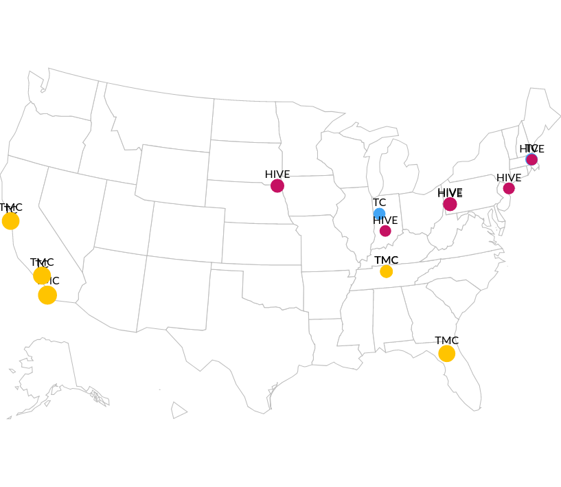

# CSV Tutorial

In this tutorial we will explore the features available when importing CSV files.

## CSV Preparation

- The first line of the CSV is a header row.
- Each subsequent row is a single record.
- Each cell of the header row is the name of a `Data Variable`, unless `$$` appears in the name.
  - If `$$` appears in the name, the first part of the string is the `Data Variable` and the last part is the `Graphic Variable` it maps to. Thus 'Favorite Food$$shape' defines a `Graphic Variable`: 'shape', which is derived from a `Data Variable`: 'Favorite Food'.

### Example 1

|MyID|State|State$$color|
|--|--|--|
|123|IN|#ff00ff|
|456|OH|#00ffff|

For the above table, we have two `Data Variables`: 'MyID' and 'State' and one custom `Graphic Variable` mapping from State to color: 'State$$color'.

### Default Graphic Variable Mappings

- Each `Data Variable` column in the CSV is inspected to guess it's data type: string, integer, number, or boolean (boolean is transformed into 'true'/'false' strings).
- All `Data Variables` regardless of data type are assigned these `Graphic Variable` mappings: 'identifier', 'axis', 'text', 'tooltip', 'label', 'input', and 'order'.
- Numbers and integers also include 'areaSize', 'strokeWidth', and 'fontSize' `Graphic Variable` mappings.
- `Data Variables` with the word 'color' in them are assigned the 'color' and 'strokeColor' `Graphic Variable` mappings.
- Finally, `Data Variables` that match a known `Graphic Variable` type are assigned that `Graphic Variable` mapping.

## Example 2

Here is a real-world example using the CSV import feature. The following data shows HuBMAP-funded centers with latitude, longitude, and custom size and color `Graphic Variables`.

|FOA          |Type|Project Number |Organization Name                  |Organization ZIP|Total Budget|Random|identifier|Type$$color|Organization Name$$color|Total Budget$$areaSize|latitude|longitude|
|-------------|----|---------------|-----------------------------------|----------------|------------|------|----------|-----------|------------------------|----------------------|--------|---------|
|RFA-RM-17-025|TC  |1UG3HL145593-01|PURDUE UNIVERSITY                  |47907-2114      |375000      |      |1         |#42a5f5    |#a6cee3                 |244.230769230769      |40.4249 |-86.9162 |
|RFA-RM-17-025|TC  |1UG3HL145600-01|HARVARD UNIVERSITY                 |02138-5319      |420000      |      |2         |#42a5f5    |#1f78b4                 |261.538461538462      |42.377  |-71.1256 |
|RFA-RM-17-025|TC  |1UG3HL145609-01|CALIFORNIA INSTITUTE OF TECHNOLOGY |91125-0001      |375000      |      |3         |#42a5f5    |#b2df8a                 |244.230769230769      |34.1478 |-118.1445|

([source file](16-HuBMAP-projects-with-zip.MAV.csv))

Loading this into Make-a-Vis, one can create a Geographic Map like below.

([source MAV project file](16-HuBMAP-projects-with-zip.yml))
